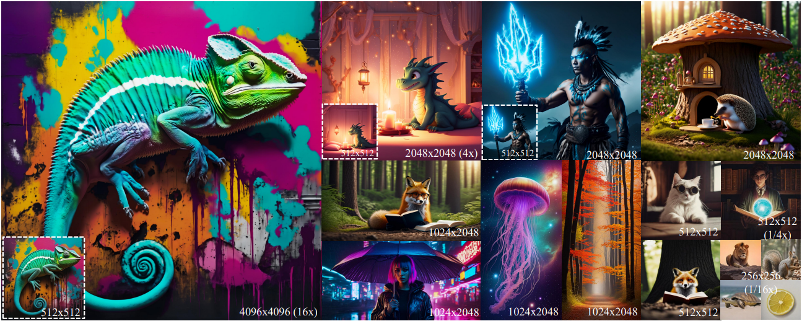

<div align="center">
    <h1 align="center"> InfoScale: Unleashing Training-free Variable-scaled Image Generation via Effective Utilization of Information
    </h1>
</div>
<div align="center">
    <a href="https://arxiv.org/abs/2509.01421">
        
    </a>
</div>


## ⚙️ Setup

### Install Environment via Anaconda
```bash
conda create -n infoscale python=3.10
conda activate infoscale
pip install -r requirements.txt
```

## 💫 Inference with Command
Our method supports both low-resolution and high-resolution image generation and can also be plug-and-play into existing methods.

### 0. Minor code modification
We need to use an `inner_dim parameter` in Attention, but in the current version of diffusers, this parameter cannot be directly accessed through `Attention.inner_dim`. For this reason, we need to make appropriate modifications to the source code.

The code is in 
`xxx/miniconda3/envs/infoscale/lib/python3.10/site-packages/diffusers/models/attention_processor.py`
```
class Attention(nn.Module):
    def __init__(
        self,
        ...
    ):
        super().__init__()
        inner_dim = dim_head * heads
        # add this new line
        self.inner_dim = inner_dim
        ...
```

### 1. lower-Resolution Text-to-Image
1) Navigate to the low resolution folder
1) Modify model path in the `run_sd_256x256.sh` and `run_sdxl_512x512.sh`, and then input the following commands in the terminal.
2) Input the following commands in terminal:
```bash
# SD1.5 256x256
bash run_sd_256x256.sh

# SD2.1 256x256
bash run_sd_256x256.sh

# SDXL 512x512
bash run_sdxl_512x512.sh
```

### 2. higher-Resolution Text-to-Image
1) Navigate to the high resolution folder
1) Modify model path in the `run_sd_1024x1024.sh`, `run_sd_2048x2048.sh`, `run_sdxl_2048x2048.sh` and `run_sdxl_4096x4096.sh`, and then input the following commands in the terminal.
2) Input the following commands in terminal:
```bash
# SD1.5 1024x1024
bash run_sd_1024x1024.sh

# SD1.5 2048x2048
bash run_sd_1024x1024.sh

# SD2.1 1024x1024
bash run_sd_1024x1024.sh

# SD2.1 2048x2048
bash run_sd_1024x1024.sh

# SDXL 2048x2048
bash run_sdxl_2048x2048.sh

# SDXL 4096x4096
bash run_sdxl_4096x4096.sh
```

## Acknowledgements
We thank [ScaleCrafter](https://github.com/YingqingHe/ScaleCrafter), [FouriScale](https://github.com/LeonHLJ/FouriScale), and [FreeScale](https://github.com/ali-vilab/FreeScale) for their great work, upon which our repo is built.


## Cite
```
@article{zhang2025infoscale,
  title={InfoScale: Unleashing Training-free Variable-scaled Image Generation via Effective Utilization of Information},
  author={Zhang, Guohui and Tan, Jiangtong and Huang, Linjiang and Yuan, Zhonghang and Zheng, Naishan and Huang, Jie and Zhao, Feng},
  journal={arXiv preprint arXiv:2509.01421},
  year={2025}
}
```